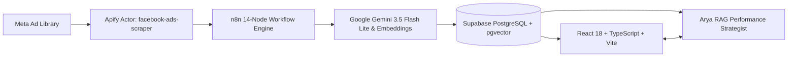
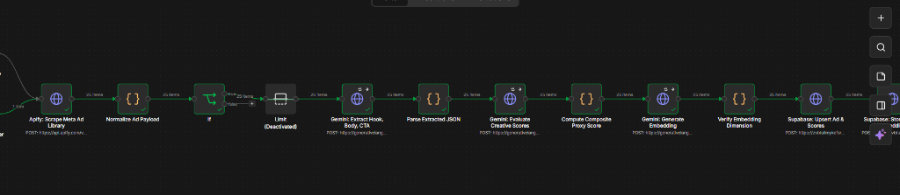
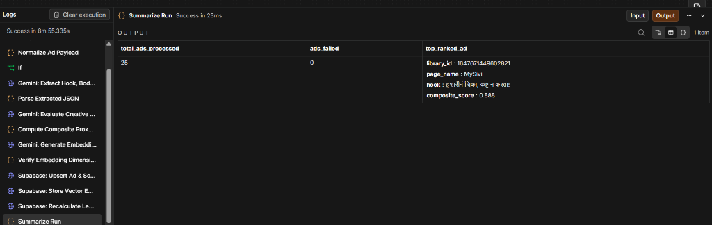
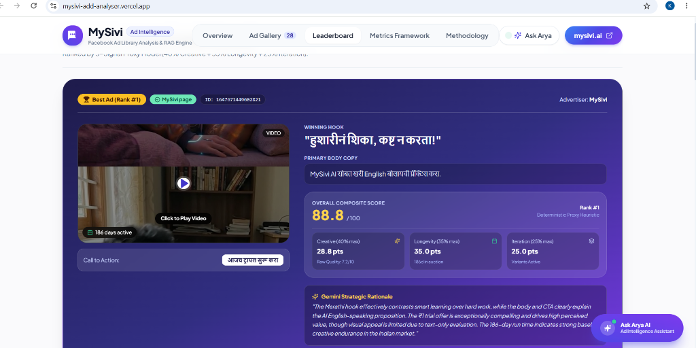
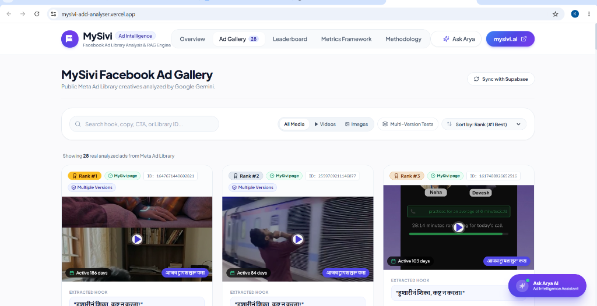
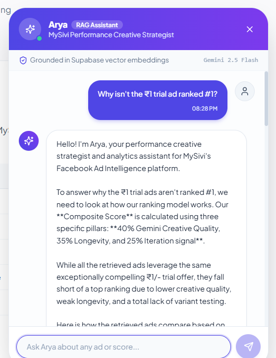

# MySivi Facebook Ad Intelligence & RAG Platform

> An end-to-end, automated ad intelligence system that scrapes, evaluates, and ranks real Meta Ad Library creatives for MySivi using an n8n pipeline, Google Gemini AI, Supabase vector embeddings, and an interactive RAG performance strategist.

---

## Links
- GitHub Repository: https://github.com/karishma0624/Mysivi_add_analyser.git
- Live Deployed App: https://mysivi-add-analyser.vercel.app/
- n8n Workflow JSON: https://drive.google.com/file/d/1YLi4GY0wZFX91vw1OgFMj3vtN1mNFKo_/view?usp=sharing
- Loom Video Walkthrough: https://drive.google.com/file/d/1e6pWpN1Ji88Q2ibs9DmSUSxVpqU8tt38/view?usp=sharing

---

## Assignment Context

This project delivers an automated n8n workflow and web application to scrape and analyze active Meta Ad Library advertisements for **MySivi** (an AI English-speaking practice app), extract structured marketing copy (hook, body, CTA, and offer details), and programmatically identify the #1 top-performing ad using an objective proxy scoring framework.

The exact Meta Ad Library source query used is:
```text
https://www.facebook.com/ads/library/?active_status=active&ad_type=all&country=IN&is_targeted_country=false&media_type=all&q=%22MySivi%22&search_type=keyword_exact_phrase&sort_data[direction]=desc&sort_data[mode]=total_impressions
```

---

## Architecture



---

## Final n8n Workflow (14 Nodes)

The ingestion engine ([`n8n/mysivi-ad-scraper-workflow.json`](n8n/mysivi-ad-scraper-workflow.json)) operates as an automated, paced 14-item pipeline in exact sequential execution order:

1. **Manual Run Trigger** (with optional disabled Weekly Schedule): Initiates the scraping job on-demand or on a scheduled cadence.
2. **Apify: Scrape Meta Ad Library**: Executes the `apify/facebook-ads-scraper` actor targeting active Indian ads with keyword `"MySivi"`.
3. **Normalize Ad Payload**: Standardizes raw Meta payloads, computes running longevity days, maps creative media, and formats timestamps.
4. **If (Text Validation Filter)**: Evaluates raw copy text and skips empty-text ads to ensure nothing is invented or hallucinated.
5. **Gemini: Extract Hook, Body, CTA**: Calls `gemini-3.5-flash-lite` with minimal thinkingLevel to parse hooks, primary body copy, explicit CTAs, and promotional offers.
6. **Parse Extracted JSON**: Validates and serializes the structured JSON response returned by the extraction model.
7. **Gemini: Evaluate Creative Scores**: Prompts `gemini-3.5-flash-lite` to score 5 creative dimensions (Hook, Clarity, CTA Strength, Visual Appeal, Offer Strength) on a 0–10 scale.
8. **Compute Composite Proxy Score**: Merges scores into the deterministic formula (40% Creative Quality + 35% Longevity + 25% Iteration signal).
9. **Gemini: Generate Embedding**: Generates a 768-dimensional vector representation using `gemini-embedding-001` with `taskType: RETRIEVAL_DOCUMENT`.
10. **Verify Embedding Dimension**: Verifies that the returned vector contains exactly 768 dimensions before writing to storage.
11. **Supabase: Upsert Ad & Scores**: Idempotently upserts creative metadata, extracted copy, and calculated scores into `ads`, `ad_analysis`, and `ad_scores`.
12. **Supabase: Store Vector Embedding**: Inserts the validated 768-dim embedding into `ad_embeddings` with an HNSW cosine similarity index.
13. **Supabase: Recalculate Leaderboard Ranks**: Calls the `recalculate_ad_ranks` database function (executed once per pipeline run) to re-index all rankings.
14. **Summarize Run**: Computes batch execution summary metrics (`total_ads_processed`, `ads_failed`, `top_ranked_ad`).

---

## Scoring Model

$$\text{Composite Score} = 0.40 \times \text{Creative Quality} + 0.35 \times \text{Longevity} + 0.25 \times \text{Iteration}$$

- **Creative Quality (40% weight)**: The normalized average of five 0–10 Gemini subscores (Hook, Clarity, CTA Strength, Visual Appeal, and Offer Strength) measuring copy persuasion and message relevance.
- **Longevity Signal (35% weight)**: Measures how many days an ad has continuously survived in auction normalized against a 90-day threshold ($\min(\text{days}/90, 1)$), reflecting advertiser willingness to maintain budget behind profitable creative.
- **Iteration Signal (25% weight)**: Measures active creative testing by rewarding creatives deployed with multiple active versions (`has_multiple_versions`).

> **Note on Public Meta Ad Library Data**: Public Meta Ad Library data does not expose private auction metrics (impressions, click-through rate / CTR, cost per click / CPC, CPM, or spend) for commercial app-install campaigns. Consequently, this deterministic proxy model combines longevity, variant iteration, and AI creative evaluation to identify proven winners without guessing private data.

### Top-Ranked Winning Ad (#1)
- **Library ID**: `1647671449602821`
- **Extracted Hook**: *"हुशारीनं शिका, कष्ट न करता!"* (Marathi)
- **Composite Score**: **88.8 / 100** (Creative: 28.8 pts | Longevity: 35.0 pts | Iteration: 25.0 pts)
- **Longevity**: Active for **186 days** with multiple active variants.

---

## Tech Stack

- **Workflow Orchestration**: [n8n](https://n8n.io/) (14-item paced linear flow, 7s batch interval, error triggers).
- **Data Extraction**: [Apify](https://apify.com/) (`apify/facebook-ads-scraper` actor).
- **Artificial Intelligence**:
  - `gemini-3.5-flash-lite`: Used for copy extraction and scoring (with `thinkingLevel: "minimal"`). Avoided `gemini-2.5-flash-lite` as it is closed to new users.
  - `gemini-embedding-001`: Generates 768-dimensional embeddings (`taskType: RETRIEVAL_DOCUMENT` in n8n; `RETRIEVAL_QUERY` in Edge Function).
- **Database & Vector Search**: [Supabase](https://supabase.com/) (PostgreSQL 15, `pgvector` HNSW cosine indexing, and Edge Functions).
- **Frontend Web Application**: React 18, TypeScript, Vite, Tailwind CSS, Lucide Icons.

---

## Live Demo & Screenshots

- **Deployed Live URL**: **[https://mysivi-add-analyser.vercel.app/](https://mysivi-add-analyser.vercel.app/)**

### 1. n8n 14-Node Ingestion & AI Scoring Pipeline


### 2. Execution Summary (25 Ads Processed, 0 Failures)


### 3. Leaderboard & #1 Winning Ad Spotlight


### 4. Ad Gallery with One-Click Video Playback


### 5. Arya Grounded RAG Performance Strategist


---

## Quickstart

### 1. Clone the Repository
```bash
git clone https://github.com/karishma0624/Mysivi_add_analyser.git
cd Mysivi_add_analyser
```

### 2. Configure Environment Variables
Create `.env` in the root and `frontend/.env.local` in the frontend directory. Only provide variable names:

**Root `.env` (for n8n and Supabase Edge Functions)**:
```env
APIFY_API_TOKEN=
GEMINI_API_KEY=
GEMINI_CHAT_MODEL=gemini-3.5-flash-lite
SUPABASE_URL=
SUPABASE_SERVICE_ROLE_KEY=
```

**Frontend `frontend/.env.local` (Client-safe public variables only)**:
```env
VITE_SUPABASE_URL=
VITE_SUPABASE_ANON_KEY=
```

### 3. Run the Frontend Locally
```bash
cd frontend
npm install
npm run dev
```
Open [http://localhost:5173](http://localhost:5173) in your browser.

---

## Known Limitations

1. **Proxy Scoring vs. Private Meta Metrics**: Ranks are based on observable proxy signals (creative quality, longevity, and iteration) rather than internal conversion tracking, as Meta does not publicly expose auction revenue data.
2. **No Public Impressions, Spend, or CTR**: Public Meta Ad Library data strictly restricts impressions and spend metrics to political and issue-based ads; commercial EdTech app-install ads do not include these values.
3. **Facebook CDN Creative URLs Expire**: Public CDN media links (`scontent.xx.fbcdn.net`) expire over time, requiring periodic pipeline re-runs to refresh cached preview URLs.
4. **Text-Inferred Visual Appeal Subscore**: Visual appeal is scored by Gemini from parsed copy cues and creative format structure rather than raw video computer vision analysis.

---

## Future Enhancements

- **Real Meta Ads Manager API Integration**: Direct OAuth integration once advertiser access is granted to cross-validate proxy scores against verified ROAS, CPC, and CTR figures.
- **Content-Hash Caching in n8n**: SHA-256 copy hashing in the n8n pipeline to skip redundant Gemini extraction calls on unchanged ads while preserving dynamic longevity recalculation.
- **Historical Score Tracking Over Time**: Tracking weekly trajectory trends per creative to alert marketers when ad fatigue sets in.
- **Multimodal Visual Scoring**: Ingesting raw MP4 video frames and creative image files directly into Gemini multimodal vision for computer-vision creative audits.

---

## Deliverables

- **n8n Workflow JSON**: [`n8n/mysivi-ad-scraper-workflow.json`](n8n/mysivi-ad-scraper-workflow.json)
- **Executive Ad Intelligence Report (PDF)**: [`docs/MySivi_Ad_Intelligence_Report.pdf`](docs/MySivi_Ad_Intelligence_Report.pdf)
- **Technical Methodology Report (Markdown)**: [`docs/MySivi_Ad_Intelligence_Report.md`](docs/MySivi_Ad_Intelligence_Report.md)
- **Loom Video Walkthrough**: [Watch Video Walkthrough](https://drive.google.com/file/d/1e6pWpN1Ji88Q2ibs9DmSUSxVpqU8tt38/view?usp=sharing)

---

**GitHub Repository**: [https://github.com/karishma0624/Mysivi_add_analyser](https://github.com/karishma0624/Mysivi_add_analyser)
